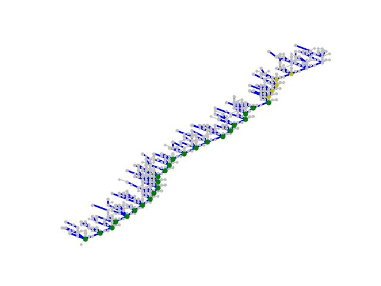

# Casper+Sharding chain v2.1
###### 译者：程阳
原文：https://notes.ethereum.org/SCIg8AH5SA-O4C1G1LYZHQ

### 工作正在进行中！！！

这是描述Casper + Sharding链第2.1版规范的工作进度文档。

在这个协议中，有一条中心PoS链存储和管理当前活跃的PoS验证者们。成为一名初始验证者唯一可用的机制是在现有的PoW主链上发送一条包含32ETH的交易。当你这样做了，PoS链一处理区块，你将会处在一个队列中，并最终以一名活跃的验证者正式加入，直到你自愿退出，或者因异常行为被处罚而被强制注销。

PoS链上的主要负载源是认证（attestations）。一个认证包括两方面角色：
1. 证实信标区块（beacon chain）中的一些父区块
2. 证实一个区块在分片（shard）中的哈希（足够多这样的证明会创建一个交联（crosslink），来确保分片中的区块进入主链）

每个分片（总共可能有1024个分片）都是一个PoS链，分片链存储交易和账户信息。交联提供“确认”分片中的片段进入主链的服务，同时也是不同分片之间进行通信的主要方式。

值得一提的是，还可以考虑一种更简单的“最小切分算法”，其中交联只是提交的数据块的散列，这些数据块本身并不以任何方式相互链接。

注意： 在[https://github.com/ethereum/beacon_chain](https://github.com/ethereum/beacon_chain) 的python代码和 [an ethresear.ch post](https://ethresear.ch/t/convenience-link-to-full-casper-chain-v2-spec/2332)没有反映最新的更改。如果有人么差异，这个文档很可能会反映出最新的变化。

##### 术语：
- 验证者（Validator）—— Casper/分片共识系统的参与者。通过存32ETH到Casper机制中就能成为一名验证者。

- 活跃验证者集合（Active validator set）—— 那些正在参与的验证者，同时也是Casper机制寻求产生以及证明区块，交联和其他共识对象的验证者。

- 委员会（Committee）—— 从活跃验证者集合中（伪）随机抽样的子集。当一个委员会被集体提及时，如“该委员会证明X”，这种假定为“该委员会的某个子集包含足够的验证者，该协议承认其代表委员会”。

- 提案者（Proposer）—— 创建一个区块的验证者

- 证明者（Attester）—— 在区块上签名的委员会中的一名验证者

- 信标链（Beacon chain）—— 中心PoS链是分片系统的基础

- 分片链（Shard chain）—— 进行交易和存储账户数据的链之一

- 交联（Crosslink）—— 来自委员会的一组签名，证明一个块在分片链中，（签名）可以包含在信标链中。交联是信标链“了解”分片链更新状态的主要手段。

- 时间槽（Slot）—— 每8秒一个周期，在一个周期里提案者可以创建一个区块，证明者可以去做验证

- 改朝换代（Dynasty transition）—— 更换验证者集合

- 朝代（Dynasty）—— 创世以来，在一个给定的链中改朝换代的次数

- 时代（Cycle）—— 所有验证这都有一次机会进行验证的一组块

- 最终化，合理（Finalized, justified） —— 参见Casper FFG终稿https://arxiv.org/abs/1710.09437

##### 常量：
- SHARD_COUNT —— 分片数量的常量。现在设置的是1024

- DEPOSIT_SIZE —— 32ETH

- MAX_VALIDATOR_COUNT —— 2<sup>22</sup> = 4194304 # 注意：这意味着在同一时间最多只能下注1.34亿ETH
译者注：4194304 * 32 ETH = 134217728 ETH

- SLOT_DURATION —— 8秒

- CYCLE_LENGTH —— 64个时间槽

- MIN_COMMITTEE_SIZE —— 128（理论基础：参见这里推荐的最小值111 [https://vitalik.ca/files/Ithaca201807_Sharding.pdf](https://vitalik.ca/files/Ithaca201807_Sharding.pdf)）

##### PoW 主链的改变：
本PoS/分片提案可以独立于现存的PoW主链实施。主链只需要做两处变更（且第二个在技术上讲不是严格必要的）。

- 在主链上添加一个合约。该合约允许你存```DEPOSIT_SIZE```(32)个ETH。```deposit```函数接收5个参数，分别是（i）```pubkey```(bytes)，(ii)```withdrawal_shard_id```(int)，(iii)```withdrawal_addr```(address)，（iv）```randao_commitment```(bytes32)，(v) ```bls_proof_of_possession```
- 主链客户端将实现一个方法，```prioritize(block_hash,value)```。如果该区块可用并得到验证，该方法将（区块）分数设定为给定值，并递归调整所有后代的分数。这允许PoS信标链的终结小工具也能隐式地最终化主链区块。注意，将该方法实施到PoW客户端是对PoW分叉选择规则的更改，因此也是一种分叉。

##### 信标链
信标链是PoS系统中的“主链”。信标链的主要职责是：
- 存储和维护活跃的，处于排队中和退出的验证者集合
- 处理交联（参见前面）
- 逐块处理共识，以及FFG终结小工具

这是进入每个信标链的区块的字段：
```
fields = {
    # Hash of the parent block
    'parent_hash': 'hash32',
    # Slot number (for the PoS mechanism)
    'slot_number': 'int64',
    # Randao commitment reveal
    'randao_reveal': 'hash32',
    # Attestations
    'attestations': [AttestationRecord],
    # Reference to PoW chain block
    'pow_chain_ref': 'hash32',
    # Hash of the active state
    'active_state_root': 'hash32',
    # Hash of the crystallized state
    'crystallized_state_root': 'hash32',
}
```

信标链状态被分为两部分，活跃状态和结晶状态。
这是 ```ActiveState```：
```
fields = {
    # Attestations that have not yet been processed
    'pending_attestations': [AttestationRecord],
    # Most recent 2 * CYCLE_LENGTH block hashes, older to newer
    'recent_block_hashes': ['hash32']
}
```

这是 ```CrystallizedState```：
```
fields = {
    # List of validators
    'validators': [ValidatorRecord],
    # Last CrystallizedState recalculation
    'last_state_recalc': 'int64',
    # What active validators are part of the attester set
    # at what slot, and in what shard. Starts at slot
    # last_state_recalc - CYCLE_LENGTH
    'indices_for_slots': [[ShardAndCommittee]],
    # The last justified slot
    'last_justified_slot': 'int64',
    # Number of consecutive justified slots ending at this one
    'justified_streak': 'int64',
    # The last finalized slot
    'last_finalized_slot': 'int64',
    # The current dynasty
    'current_dynasty': 'int64',
    # The next shard that crosslinking assignment will start from
    'crosslinking_start_shard': 'int16',
    # Records about the most recent crosslink `for each shard
    'crosslink_records': [CrosslinkRecord],
    # Total balance of deposits
    'total_deposits': 'int256',
    # Used to select the committees for each shard
    'dynasty_seed': 'hash32',
    # Last time the crosslink seed was reset
    'dynasty_seed_last_reset': 'int64'
}
```

这是```ShardAndCommittee``` 对象的形式：

```
fields = {
    # The shard ID
    'shard_id': 'int16',
    # Validator indices
    'committee': ['int24']
}
```

每一个```ValidatorRecord```都包含了一个验证者（validator）的信息：
```
fields = {
    # The validator's public key
    'pubkey': 'int256',
    # What shard the validator's balance will be sent to
    # after withdrawal
    'withdrawal_shard': 'int16',
    # And what address
    'withdrawal_address': 'address',
    # The validator's current RANDAO beacon commitment
    'randao_commitment': 'hash32',
    # Current balance
    'balance': 'int64',
    # Dynasty where the validator  is inducted
    'start_dynasty': 'int64',
    # Dynasty where the validator leaves
    'end_dynasty': 'int64'
}
```  

在```CrosslinkRecord``` 包含了上一个被提交到链上的完整的交联信息：
```
fields = {
    # What dynasty the crosslink was submitted in
    'dynasty': 'int64',
    # The block hash
    'hash': 'hash32'
}
```

##### 信标链处理
在很多方面，处理信标链基本上与处理一条PoW的链很相似。客户端下载和处理区块，并维护当前“权威链”的一个视图，在当前“块头”终止。然而，由于信标链与现有的PoW链的关系，并且因为它是一个PoS链，因此还是有一些区别。

对于信标链上的区块想要被一个node处理，得满足三个条件：
- ```parent_hash```指向的双亲已经被处理并被接受
- ```pow_chain_ref```指向PoW的主链区块已经被处理并被接受
- node的本地时钟时间大于或等于```GENESIS_TIME + slot_number * SLOT_DURATION```计算而得的最小时间戳

如果不满足这三个条件，客户端应该会延迟处理该区块直到三个条件全部满足。

因为权益证明机制区块生产稍有不同。客户端要创建一个区块的时候，会简单的检查它认为权威的链，而且会查看他的slot numbner；当该时间槽（slot）到来时，它根据需要选择提案或者验证一个区块。

##### 信标链分叉选择规则
信标链使用 Casper FFG 的“热衷于包含（slot number）得分最高的合法区块的链”作为分叉选择规则。为了选择从同一合法区块派生的链，该链使用了“即时消息驱动GHOST（immediate message driven GHOST）”（IMD GHOST）来选择链头。

详细信息参见：[https://ethresear.ch/t/beacon-chain-casper-ffg-rpj-mini-spec/2760](https://ethresear.ch/t/beacon-chain-casper-ffg-rpj-mini-spec/2760)

对于具有网络仿真器的实现，请参见：[https://github.com/ethereum/research/blob/master/clock_disparity/ghost_node.py](https://github.com/ethereum/research/blob/master/clock_disparity/ghost_node.py)

这里有一个它的工作示例（绿色的是终结区块，黄色的是合法区块，灰色的是证明）



##### 信标链状态转移函数
我们现在定义状态转移函数。从比较高的层面讲，状态转移由2部分组成：
1. 结晶状态重计算（crystallized state recalculation），只发生在```block.slot_number >= last_state_recalc + CYCLE_LENGTH```，并且影响```CrystallizedState```(结晶状态)和```ActiveState```(活跃状态)。
2. 处理每个块（per-block processing），这发生在每个块（如果是在结晶状态重计算期间，它发生在结晶状态重计算之后）并且只影响```ActiveState```(活跃状态)。

结晶状态重计算一般侧重验证人集合的改变上，包括调整余额，添加和移除验证者，以及处理交联和管理区块校验，而处理每个块一般侧重验证聚合签名和在活跃状态中保存相关区块内活动的临时记录。

##### 辅助函数
我们通过定义一些辅助算法开始。首先，该函数会选择以ixe活跃的验证者：
```
def get_active_validator_indices(validators, dynasty):
    o = []
    for i in range(len(validators)):
        if validators[i].start_dynasty <= dynasty < \
                validators[i].end_dynasty:
            o.append(i)
    return o
```

现在，一个函数把这个列表打乱：
```
def shuffle(lst, seed):
    assert len(lst) <= 16777216
    o = [x for x in lst]
    source = seed
    i = 0
    while i < len(lst):
        source = blake(source)
        for pos in range(0, 30, 3):
            m = int.from_bytes(source[pos:pos+3], 'big')
            remaining = len(lst) - i
            if remaining == 0:
                break
            rand_max = 16777216 - 16777216 % remaining
            if m < rand_max:
                replacement_pos = (m % remaining) + i
                o[i], o[replacement_pos] = o[replacement_pos], o[i]
                i += 1
    return o
```

然后，把这个列表分成N个片段：
```
def split(lst, N):
    return [lst[len(lst)*i//N: len(lst)*(i+1)//N] for i in range(N)]
```

现在，把这些辅助方法集合到一起：
```
def get_new_shuffling(seed, validators, dynasty, crosslinking_start_shard):
    avs = get_active_validator_indices(validators, dynasty)
    if len(avs) >= CYCLE_LENGTH * MIN_COMMITTEE_SIZE:
        committees_per_slot = len(avs) // CYCLE_LENGTH // (MIN_COMMITTEE_SIZE * 2) + 1
        slots_per_committee = 1
    else:
        committees_per_slot = 1
        slots_per_committee = 1
        while len(avs) * slots_per_committee < CYCLE_LENGTH * MIN_COMMITTEE_SIZE \
                and slots_per_committee < CYCLE_LENGTH:
            slots_per_committee *= 2
    o = []
    for i, slot_indices in enumerate(split(shuffle(avs, seed), CYCLE_LENGTH)):
        shard_indices = split(slot_indices, committees_per_slot)
        shard_id_start = crosslinking_start_shard + \
            i * committees_per_slot // slots_per_committee
        o.append([ShardAndCommittee(
            shard_id = (shard_id_start + j) % SHARD_COUNT,
            committee = indices
        ) for j, indices in enumerate(shard_indices)])
    return o
```

下边是一张工作流程示意图：


同时，我们定义
```
def get_indices_for_slot(crystallized_state, slot):
    ifh_start = crystallized_state.last_state_recalc - CYCLE_LENGTH
    assert ifh_start <= slot < ifh_start + CYCLE_LENGTH * 2
    return crystallized_state.indices_for_slots[slot - ifh_start]

def get_block_hash(active_state, curblock, slot):
    sback = curblock.slot_number - CYCLE_LENGTH * 2
    assert sback <= slot < sback + CYCLE_LENGTH * 2
    return active_state.recent_block_hashes[slot - sback]
```

这里，```get_block_hash(*, *, h)``` 应该总是在时间 ```h``` 的时候返回一个区块，```get_indices_for_slot(*, h)``` 在朝代（dynasty）变更之前不应该有变化。

##### 启动时
- 让 ```x = get_new_shuffling(bytes([0] * 32), validators, 1, 0)``` 然后设置 ```crystallized_state.indices_for_slots``` 为  ```x + x```

- 设置 ```crystallized_state.dynasty = 1```

- 设置 ```crystallized_state.crosslink_records``` 为  ```[CrosslinkRecord(dynasty=0, hash= bytes([0] * 32)) for i in range(SHARD_COUNT)]```

- 设置 ```total_deposits``` 为 ```sum([x.balance for x in validators])```

- 设置 ```recent_block_hashes``` 为  ```[bytes([0] * 32) for _ in range(CYCLE_LENGTH * 2)]```

其他在活动或者终结状态的值可以根据上下文设为0或者空。

##### 处理每个块
首先，将```recent_block_hashes```设置为下边输出的样子：
```
def get_new_recent_block_hashes(old_block_hashes, parent_slot,
                                current_slot, parent_hash):
    d = current_slot - parent_slot
    return old_block_hashes[d:] + [parent_hash] * min(d, len(old_block_hashes))
```

这里，```get_block_hash``` 的输出不应该改变，除非他不再抛出 ```current_slot - 1````, 而抛出 ```current_slot - CYCLE_LENGTH * 2 - 1```

一个区块可以有0个或者多个 ```AttestationRecord```,每一个 ```AttestationRecord``` 对象结构如下：
```
fields = {
    # Slot number
    'slot': 'int64',
    # Shard ID
    'shard_id': 'int16',
    # List of block hashes that this signature is signing over that
    # are NOT part of the current chain, in order of oldest to newest
    'oblique_parent_hashes': ['hash32'],
    # Block hash in the shard that we are attesting to
    'shard_block_hash': 'hash32',
    # Who is participating
    'attester_bitfield': 'bytes',
    # Last justified block
    'justified_slot': 'int256',
    'justified_block_hash': 'hash32',
    # The actual signature
    'aggregate_sig': ['int256']
}
```

每个证明需要作一下验证：
- 验证 ```slot < block.slot_number``` 和 ```slot >= max(block.slot_number - CYCLE_LENGTH, 0)```

- 验证链中给出的 ```justified_slot``` 和 ```justified_block_hash``` 等于或早于终结状态中的 ```last_justified_slot```

- 计算 ```parent_hashes``` = ```[get_block_hash(active_state, block, slot - CYCLE_LENGTH + i) for i in range(1, CYCLE_LENGTH - len(oblique_parent_hashes) + 1)] + oblique_parent_hashes``` (例如，如果```CYCLE_LENGTH = 4```, ```slot = 5```,实际区块从时间0开始的哈希是 ```Z A B C D E F G H I J```,而且 ```oblique_parent_hashes = [D', E']``` 则 ```parent_hashes = [B, C, D' E']```)

- 让 ```attestation_indices``` 成为 ```get_indices_for_slot(crystallized_state, slot)[x]```, 选择 ```x``` 所以 ```attestation_indices.shard_id``` 和创建验证记录的检验者集合的 ```shard_id```的值相等

- 验证 ```len(attester_bitfield) == ceil_div8(len(attestation_indices))```，其中```ceil_div8 = (x + 7) // 8```。 验证位```len(attestation_indices)....```和更高的，如果出现了（比如，```len(attestation_indices``` 不是8的倍数），就全为0

- 通过将所有测试者的公钥加入 ```attestation_indices``` 来为对应```attester_bitfield```（第i位是```attester_bitfield[i // 8] >> (7 - (i %8))) % 2```）等于1的人导出公钥集合

- 通过生成的公钥组和消息 ```hash(slot.to_bytes(8, 'big') + parent_hashes + shard_id + shard_block_hash)``` 验证  ```aggregate_sig```

在 ```active_state``` 中扩展 ```AttestationRecord``` 对象的列表，按照块中新添加的顺序排列。

确认 ```get_indices_for_slot(crystallized_state, slot)[0]``` 中的第 ```slot % len(get_indices_for_slot(crystallized_state, slot)[0])``` 个验证者在至少一个```AttestationRecord```对象中；然后这个验证者就可以创建区块提案了。

##### 状态重计算
重复 ```slot - last_state_recalc >= CYCLE_LENGTH``` ：

所有 ```last_state_recalc - CYCLE_LENGTH ... last_state_recalc - 1``` 中的时间槽 ```s```：
- 最少判定一次合法区块中的全部验证者集合

- 判定所有验证者的总余额。如果这个值的乘以3等于或者大于所有活跃验证者集合总余额的2倍，就设置 ```last_justified_slot = max(last_justified_slot, s)``` 和 ```justified_streak += 1```，否则```justified_streak = 0```

- 如果 ```justified_streak >= CYCLE_LENGTH + 1``` ，则令 ```last_finalized_slot = max(last_finalized_slot, s - CYCLE_LENGTH - 1)```

- 删除所有早于的 ```last_state_recalc``` 证明记录

同时：
- 令 ```last_state_recalc += CYCLE_LENGTH```
- 令 ```indices_for_slots[:CYCLE_LENGTH] = indices_for_slots[CYCLE_LENGTH:]```

对于所有的(```shard_id, shard_block_hash```)元组，计算证实分片上那个区块哈希的验证者的总存款。如果这个值乘以3等于或者大于委员会中所有验证者总余额的2倍，而且但前朝代超过了 ```crosslink_records[shard_id].dynasty```，就令```crosslink_records[shard_id] = CrosslinkRecord(dynasty=current_dynasty, hash=shard_block_hash)```。

TODO：
- 奖励FFG成员
- 奖励委员会成员

##### 改朝换代
TODO。正在完成中。

***
备注： 完成度大约70%。缺失的主要章节是：
- Validator login/logout logic

- Logic for the formats of shard chains, who proposes shard blocks, etc. (in an initial release, if desired we could make crosslinks just be Merkle roots of blobs of data; in any case, one can philosophically view the whole point of the shard chains as being a coordination device for choosing what blobs of data to propose as crosslinks)

- Logic for inducting queued validators from the main chain

- Penalties for signing or attesting to non-canonical-chain blocks (update: may not be necessary, see [https://ethresear.ch/t/attestation-committee-based-full-pos-chains/2259](https://ethresear.ch/t/attestation-committee-based-full-pos-chains/2259))

- Slashing conditions

- Logic for withdrawing deposits to shards

- Per-validator proofs of custody

- Full rewards and penalties

- Versioning and upgrades

削减条件可能包括：
```
Casper FFG slot equivocation
Casper FFG surround
Beacon chain proposal equivocation
Shard chain proposal equivocation
Proof of custody secret leak
Proof of custody wrong custody bit
Proof of custody no secret reveal
RANDAO leak
```
